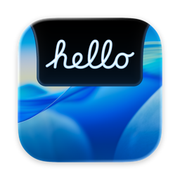
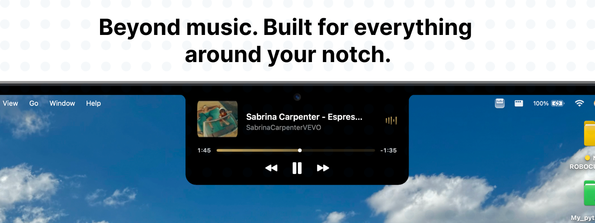
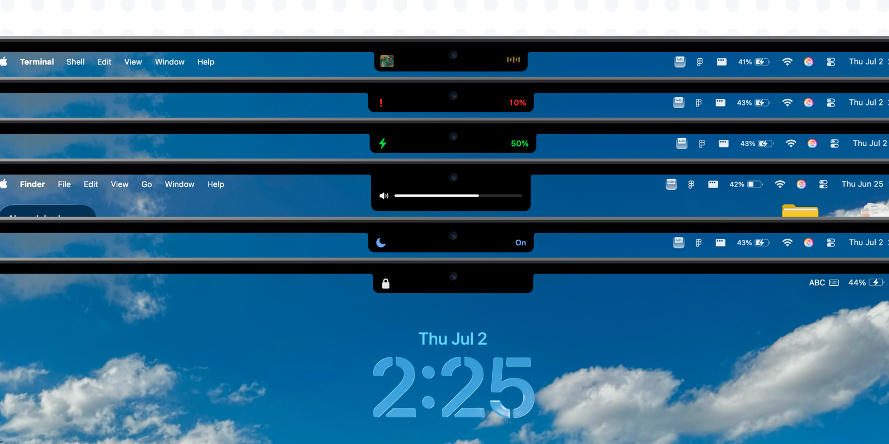

<div align="center">
  

  # NotchLand

  ### Bring your MacBook's notch to life.

  NotchLand transforms the area around the MacBook display notch into an interactive surface —
  media controls, system HUDs, AirDrop, live activities, calendar peeks, and more. A native
  **SwiftUI + AppKit** menu-bar app built in the open.

  [](LICENSE)
  [](#requirements)
  [](https://developer.apple.com/swift/)
  [](CONTRIBUTING.md)
  [](#)
  

</div>

<!--
  BANNER — drop a wide hero shot or demo GIF of the notch in action here, then
  uncomment the line below. Suggested path: docs/images/banner.png
  (recommended ~1600x900, or a screen recording exported as GIF).

  <div align="center">
    
  </div>
-->

  <div align="center">
    
  </div>

---

## Contents

- [What it does](#what-it-does)
- [Features](#features)
- [Gallery](#gallery)
- [Requirements](#requirements)
- [Build & run](#build--run)
- [Architecture](#architecture)
- [Contributing](#contributing)
- [License](#license)
- [Acknowledgments](#acknowledgments)

---

## What it does

NotchLand runs as an accessory app (no Dock icon) and overlays a floating panel exactly
where your MacBook's notch sits. It stays out of the way until something happens worth
showing — then it expands, animates, and collapses back.

> Designed for a MacBook with a display notch — NotchLand renders a floating panel where
> the notch lives.

---

## Features

| Feature | Description |
|---|---|
| **Now Playing** | Live media controls and artwork for whatever's playing, right in the notch. |
| **AirDrop** | Drag a shareable file near the notch and a drop zone opens — only for content AirDrop can actually accept — and confirms the drop. |
| **System HUDs** | Clean, Apple-style overlays for volume and brightness. |
| **Battery alerts** | Charging and low-battery notices surface in the notch. |
| **Focus alerts** | A heads-up whenever your Focus mode changes. |
| **Calendar & countdown** | A next-event peek and a countdown chip for what's coming up. |
| **Lock / unlock showcase** | A padlock animation on lock and a "welcome back" card on unlock, with away-time, battery, and your next event. |
| **Guided onboarding** | A first-launch walkthrough introduces the features and requests Calendar and Accessibility permissions step by step, both skippable. |

---

## Gallery

<div align="center">
  
</div>

_More screenshots & demo GIFs coming soon — contributions welcome! Drop images into
`docs/images/` and wire them into this section._

---

## Requirements

- **macOS 26.3** or later
- **Xcode 26.4** or later (to build from source)
- A MacBook with a display notch (recommended)

---

## Build & run

NotchLand is a standard Xcode project — no Swift Package Manager manifest, dependencies
are resolved through Xcode (Sparkle, Lottie).

```bash
# Clone
git clone https://github.com/scienceLabwork/NotchLand.git
cd NotchLand

# Build (Debug) from the command line
xcodebuild -project NotchLand.xcodeproj -scheme NotchLand -configuration Debug build

# …or just open it in Xcode (preferred for iteration — SwiftUI Previews need Xcode)
open NotchLand.xcodeproj
```

Run the tests (Swift Testing, hosted in the app target):

```bash
xcodebuild -project NotchLand.xcodeproj -scheme NotchLand -configuration Debug test \
  -destination 'platform=macOS'
```

> **Building as a contributor?** The project ships with the maintainer's signing Team
> (`H7RVWCMKF5`). To build locally, open **Signing & Capabilities** in Xcode and set your
> own Team (or disable signing). App Sandbox is off and Hardened Runtime is on by default.

---

## Architecture

NotchLand is a SwiftUI/AppKit hybrid that runs as an `LSUIElement` accessory app. Most of
the interesting design lives in one clean pipeline:

```
Controller  ──publishes──▶  Presentation { branchKey }  ──▶  FloatingNotchView
(ObservableObject)                                            (priority-ordered switch)
```

- **`AppDelegate`** bootstraps the shared singletons (`NotchSettings`, `AppState`,
  `WindowManager`) and keeps the app alive after settings windows close.
- **`WindowManager`** owns the borderless floating `NSPanel`, the menu-bar companion item,
  global drag monitors, and launch-at-login via `SMAppService`.
- **Feature controllers** each publish a `Presentation` whose `branchKey` feeds a single
  priority-ordered switch in `FloatingNotchView`:
  `screen-lock → airdrop-drop-target → battery → focus → expanded → hud → collapsed`.
  Adding a feature means adding a branch — not touching the others.
- **Settings** (`SettingsView`, `SettingsSidebar`, `*SettingsView`) is a sidebar + forms +
  a right-hand live preview of the notch.

This makes the codebase easy to extend: a new overlay is a new controller, a new
`branchKey`, and a content view — wired in at four well-defined points.

---

## Contributing

Contributions of all sizes are welcome — bug reports, fixes, features, and docs. To get
started:

- Read [**CONTRIBUTING.md**](CONTRIBUTING.md) for the full setup, signing, and build/test
  walkthrough.
- Match the surrounding code style (there's no linter — read the neighbors).
- Keep non-UI work off the main actor (the project defaults types to `@MainActor`).
- Open an **issue** to discuss anything larger than a small fix before sending a big PR.
- Keep PRs focused, and make sure the project builds and tests pass before requesting
  review.

> **Note on updates:** publishing Sparkle updates requires the maintainer's private EdDSA
> signing key and is maintainer-only. The public key in `Info.plist` is intentionally
> public and safe to ship.

---

## License

NotchLand is released under the **Apache License 2.0** — see [LICENSE](LICENSE) and
[NOTICE](NOTICE) for the full text and third-party attributions. By contributing, you
agree your contributions are licensed under the same terms.

It bundles:

- [Sparkle](https://github.com/sparkle-project/Sparkle) — permissive MIT-style license.
- [Lottie](https://github.com/airbnb/lottie-spm) — Apache License 2.0.

---

## Acknowledgments

- [Sparkle](https://sparkle-project.org) and [Lottie](https://airbnb.io/lottie/) for the
  open-source foundations this app builds on.
- Everyone who files an issue, opens a PR, or just gives the notch a try. 🙌

---

<div align="center">

**Designed, built, and maintained by [Rudra Shah](https://github.com/scienceLabwork).**

If NotchLand is useful to you, a ⭐ on the repo means a lot.

</div>
